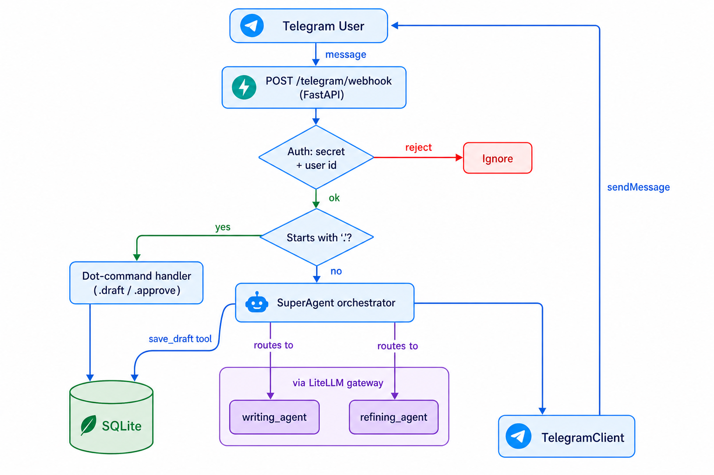

# linkforge

A multi-agent system that helps a single user ideate, write, and refine LinkedIn posts through a natural-language Telegram chat. Messages hit a FastAPI webhook, get routed by a super agent to specialist subagents (writing, refining), and drafts are persisted in SQLite. Quick `.commands` handle actions outside the chat memory of the agents.

## Project structure

```text
linkforge/
├── pyproject.toml              # Dependencies & tooling (uv, ruff)
├── uv.lock
├── README.md
├── DECISIONS.md                # Architecture decisions & rationale
├── data/
│   └── linkforge.db            # SQLite DB (state + approved drafts + agent sessions)
└── src/
    ├── main.py                 # FastAPI app, lifespan, /telegram/webhook endpoint
    ├── config.py               # Env/secrets loading
    ├── telegram/
    │   ├── client.py           # TelegramClient: sends messages via Bot API
    │   ├── webhook.py          # Webhook handling + .command routing
    │   └── auth.py             # Verify webhook secret & authorized user
    ├── database/
    │   ├── client.py           # SQLite connection helpers (low level functions)
    │   ├── schema.py           # Table creation (init_tables)
    │   └── operations.py       # Draft CRUD (save/get/approve)
    ├── agent_workforce/
    │   ├── prompt.py           # load_prompt() helper
    │   ├── tools.py            # Tools for the agents
    │   ├── super_agent/        # Orchestrator: routes to subagents
    │   │   ├── agent.py
    │   │   └── prompt.jinja2
    │   ├── writing_agent/      # Writes the main body of the LinkedIn post
    │   │   ├── agent.py
    │   │   └── prompt.jinja2
    │   └── refining_agent/     # Critiques & rewrites a draft
    │       ├── agent.py
    │       └── prompt.jinja2
    └── utils/
        └── logger.py
```

## Architecture



## How it works

1. **Telegram → webhook**: User messages reach `POST /telegram/webhook`, validated by a shared secret header and an allowlisted user id (`telegram/auth.py`).
2. **Routing**: `.commands` (`.draft`, `.approve`, `.refresh`, `.help`) are handled directly for administrative actions; all other text is sent to the `SuperAgent`.
3. **Orchestration**: The `SuperAgent` routes requests to the right specialist subagent (writing / refining) exposed as tools, and persists full drafts via the `save_draft` tool.
4. **Persistence**: Drafts and approved posts live in SQLite; agent conversation memory uses `SQLiteSession` in the same DB.
5. **Models**: All agents run through LiteLLM, making model swaps configurable.

## Deployment

1. **Install prerequisites**: [`uv`](https://docs.astral.sh/uv/) and Python `>=3.14` (`uv python install 3.14`).
2. **Clone & install deps**: `git clone repo` & ` uv sync` (creates the venv from `uv.lock`).
3. **Create a .env**: copy the `.env_local` rename to `.env`, and fill it in accordingly to which models you want to use.
4. **Set up the Telegram bot**: create a bot with [@BotFather](https://t.me/BotFather) for `BOTFATHER_API_KEY`, create a `BOTFATHER_SECRET` and find your numeric chat id for `BOTFATHER_USER_ID`.
5. **Start the app**: `uv run fastapi dev src/main.py`, SQLite tables are auto-created on startup.
